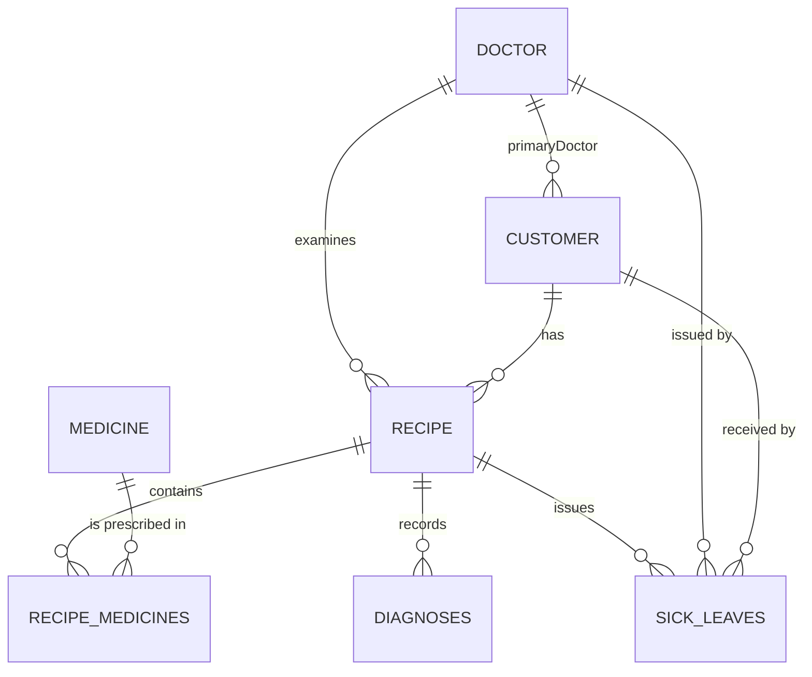

# Digital Pharmacy - Medical Record System

Comprehensive project documentation for the university MVP.

## 1. Project Overview

This project is a Spring Boot web application for managing:

- patients (customers)
- doctors
- medicines
- examinations/prescriptions (recipes)
- diagnoses
- sick leaves
- statistical and operational reports

The system implements role-based access control (RBAC) with Keycloak and supports both UI (Thymeleaf) and REST APIs.

## 2. Business Scope Covered

The current implementation supports the core requirement flow:

- A patient visits a doctor on a given date (recipe/examination).
- The doctor records diagnosis and treatment (prescribed medicines).
- The doctor can issue a sick leave.
- Doctors can review medical history and reporting data.
- Patients can view their own history via self-portal.
- System provides aggregated statistics (diagnosis, visits, sick leaves, etc.).

## 3. Technology Stack

- Java 21
- Spring Boot 3.3.4
- Spring MVC + Thymeleaf
- Spring Data JPA (Hibernate)
- Spring Security + OAuth2/OIDC + JWT
- PostgreSQL (runtime DB)
- H2 (tests)
- Gradle
- Docker Compose (Keycloak + PostgreSQL services)

## 4. High-Level Architecture

- Controllers:
  - MVC controllers under `src/main/java/com/inf/cscb869_pharmacy/**/controller`
  - REST controllers under `/api/**`
- Service layer:
  - business logic in `**/service/**`
- Repository layer:
  - JPA repositories in `**/repository/**`
- Data model:
  - entities in `**/entity/**`
- UI layer:
  - Thymeleaf templates in `src/main/resources/templates`

### Layered flow

`UI/API Controller -> Service -> Repository -> PostgreSQL`

## 5. Domain Model

Core entities:

- `Doctor`
- `Customer`
- `Medicine`
- `Recipe` (examination/prescription header)
- `RecipeMedicine` (line items)
- `Diagnosis`
- `SickLeave`

### Main relationships

- A `Doctor` has many `Recipe` records.
- A `Customer` has many `Recipe` records.
- A `Recipe` has many `RecipeMedicine` entries.
- A `Recipe` has many `Diagnosis` records.
- A `Recipe` can have associated `SickLeave` records.
- A `Customer` has one `primaryDoctor` (many customers to one doctor).



## 6. Modules and Features

### 6.1 Medicines

- CRUD operations (UI + API)
- search/filter endpoints
- role restrictions for modification

### 6.2 Doctors

- UI CRUD
- doctor lookup by email for Keycloak-to-DB mapping
- statistics support via repository queries

### 6.3 Customers

- UI + API CRUD
- soft delete (`active=false`)
- search by name, age range, allergy
- insurance validity queries

### 6.4 Recipes (Examinations/Prescriptions)

- create/edit/list/view
- patient + doctor linkage
- diagnosis text
- status management (`ACTIVE`, `FULFILLED`, `EXPIRED`, `CANCELLED`)
- medicine line items
- sick-leave metadata

### 6.5 Diagnoses

- dedicated diagnosis module (UI + API)
- ICD-10 code, severity, primary flag
- search and statistics endpoints

### 6.6 Sick Leaves

- full module (UI + API)
- create/edit/delete
- extend/cancel/complete flows
- active checks and date-range queries

### 6.7 Reports

UI reports under `/reports` and API reports under `/api/reports`:

- patients by diagnosis
- common diagnoses
- patients by primary doctor
- patient count by primary doctor
- visit count by doctor
- patient history
- examinations by date range
- doctor examinations by date range
- sick leaves by month
- doctors ranked by sick leaves issued
- valid/invalid insurance lists

## 7. Security and RBAC

Security configuration is in:

- `src/main/java/com/inf/cscb869_pharmacy/config/SecurityConfig.java`

Role model:

- `ADMIN`
- `PHARMACIST`
- `DOCTOR`
- `CUSTOMER`

Access principles:

- Public: static resources, login redirects.
- Medical staff (`DOCTOR`, `PHARMACIST`, `ADMIN`): recipes, diagnoses, sick leaves, reports.
- Create/update/delete for doctors/customers: `PHARMACIST` or `ADMIN`.
- Customer self-portal: `/my/**` for `CUSTOMER` only.
- Method-level guards also use `@PreAuthorize` on selected endpoints.

## 8. Authentication and Identity Mapping

Authentication is integrated with Keycloak (OIDC/JWT).

Important mapping behavior:

- Logged user roles are extracted from Keycloak token claims.
- Doctor personalization in UI depends on matching Keycloak email to `doctor.email`.
- Customer self-history depends on matching Keycloak email to `customers.email`.

If mapping fails, UI displays a linking/mapping warning and restricts affected actions.

## 9. Run and Setup

### 9.1 Prerequisites

- JDK 21
- Docker + Docker Compose (for Keycloak/PostgreSQL services)

### 9.2 Application configuration

Main config file:

- `src/main/resources/application.properties`

Current defaults:

- App port: `8084`
- Datasource URL: `jdbc:postgresql://localhost:5433/pharmacy_app_demo`
- Hibernate: `create-drop`
- SQL seed: enabled via `data.sql`

Note:

- `docker-compose.yml` currently exposes PostgreSQL on `5434` with DB `pharmacy`.
- Align datasource settings with your local environment before running.

### 9.3 Start services (optional via Docker)

```bash
docker-compose up -d
```

### 9.4 Run application

```bash
./gradlew bootRun
```

### 9.5 Test suite

```bash
./gradlew test
```

## 10. Seed Data and Demo Accounts

Seed script:

- `src/main/resources/data.sql`

Includes:

- expanded medicines/doctors/customers
- recipes + recipe_medicines
- diagnoses
- sick leaves
- demo email mappings for Keycloak roles

Keycloak setup guide:

- `KEYCLOAK_SETUP_GUIDE.md`

## 11. API Surface (Summary)

REST base paths:

- `/api/medicines`
- `/api/recipes`
- `/api/customers`
- `/api/diagnoses`
- `/api/sick-leaves`
- `/api/reports`

For exact endpoint list and parameters, see controller classes under:

- `src/main/java/com/inf/cscb869_pharmacy/**/controller`

Detailed API reference:

- `docs/API_REFERENCE.md`

## 12. UI Routes (Summary)

Main UI sections:

- `/` (home)
- `/dashboard`
- `/medicines`
- `/doctors`
- `/customers`
- `/recipes`
- `/diagnoses`
- `/sick-leaves`
- `/reports`
- `/my/history` (customer self-history)

## 13. Testing Status

Current tests include:

- service unit tests
- controller unit tests
- security `@WebMvcTest` role checks
- repository `@DataJpaTest` report query checks

Test sources:

- `src/test/java/com/inf/cscb869_pharmacy/**`

Tracking checklist:

- `TEST_CHECKLIST.md`

## 14. Additional Project Docs

- `TASK_CHECKLIST.md` - implementation progress
- `QUICK_START_GUIDE.md` - MVP run/demo quick guide
- `MEDICAL_RECORD_REQUIREMENTS.md` - requirement analysis (BG)
- `KEYCLOAK_SETUP_GUIDE.md` - Keycloak setup details

## 15. Known Limitations / MVP Notes

- `DoctorApiController` is not present (doctor module currently UI-centric for CRUD).
- `spring.jpa.hibernate.ddl-auto=create-drop` is development-oriented only.
- Debug-level logging is currently high/noisy for local diagnostics.
- Environment configuration (ports/database names) may need adjustment per machine.

## 16. Recommended Production Hardening (Post-MVP)

- Add Flyway/Liquibase migrations.
- Reduce sensitive/debug logging and externalize secrets.
- Add central exception handling + user-friendly error pages.
- Expand integration and end-to-end test coverage.
- Generate OpenAPI/Swagger documentation for REST APIs.
